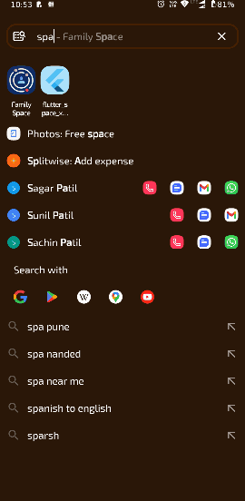

# flutter_space_x_rockets

## Getting Started

 A Flutter application that fetches and displays SpaceX rockets using GetX for state management and HTTP for API calls.
 Technologies Used
   Flutter (Dart)
   GetX (State Management)
   HTTP (API Calls)

  Features
    Fetches real-time SpaceX rocket data 📡
    Displays rocket details (name, country, engines) 🚀
    Simple & Clean UI

 How to Run the Project?
  Clone the repository
  git clone '<https://github.com/your-username/spacex_rockets.git>'

  Navigate to the project folder
   cd spacex_rockets
  Get dependencies
   flutter pub get  
  Run the app
   flutter run
